# Easy Travel BD  

<br>

**Seamless Travel Experience — Anywhere, Anytime.**

**Easy Travel BD** is a comprehensive travel management platform designed to make traveling across Bangladesh convenient and enjoyable. From booking bus tickets to finding the best hotels, tour guides, and travel agencies, our platform provides a seamless experience for travelers. Additionally, Easy Travel BD enables users to explore tourist spots, read blogs, and share their travel experiences.

---
<table align="center">
  <tr>
    <td align="center">
      
      <p><b>ASP.NET Core</b></p>
    </td>
    <td align="center">
      
      <p><b>C#</b></p>
    </td>
    <td align="center">
      
      <p><b>Microsoft SQL Server</b></p>
    </td>
    <td align="center">
      
      <p><b>Clean Architecture</b></p>
    </td>
    <td align="center">
      
      <p><b>Microsoft Azure</b></p>
    </td>
  </tr>
</table>


---

## 🌐 Live Demo

<p align="center">
  <a href="https://easytravelbd-enc3h9ehc9hng9da.eastasia-01.azurewebsites.net/" target="_blank">
    
  </a>
</p>

---
## 👨‍💻 Team

Meet the passionate developers behind **Easy Travel BD**:

| Role      | Name & GitHub Profile                               |
| --------- | --------------------------------------------------- |
| Team Lead | [Najmul Islam Naeem](https://github.com/ImamIfti056) |
| Developer | [Irfan Mahmud](https://github.com/IrfanMahmud1)             |
| Developer | [Abdur Rashed](https://github.com/abdurrashed)      |

---

### 🧠 Our Guide & Mentor

A heartfelt appreciation to **[Maynul Islam Sohel](https://github.com/sohelatbs23)**

---


## Features  

# 👥 Roles and Their Activities

| **Role**                  | **Permissions / Activities**                                                                 |
|----------------------------|----------------------------------------------------------------------------------------------|
| **Public (Anyone)**        | - Search and explore buses<br>- Explore hotels, private cars, photographers, guides, agencies <br> - Create account |
| **Registered User**        | - Book buses<br>- Book hotels<br>- Book private cars<br>- Hire photographers<br>- Hire tour guides <br> - Update their profile <br> - Show their previous history |
| **Bus Manager**            | - Add and manage buses<br>- Update bus information<br>- View bus booking history             |
| **Private Car Manager**    | - Add and manage private cars<br>- Update car information<br>- View private car bookings      |
| **Hotel Manager**          | - Add and manage hotels<br>- Update room availability<br>- View hotel booking history         |
| **Photographer**           | - Create and manage profile<br>- Manage photography bookings and schedule                     |
| **Tour Guide**             | - Create and manage profile<br>- Manage tour guide bookings and availability                  |
| **Agency Manager**         | - Add and manage travel agencies<br>- Manage agency tours and related services                |
| **Super Admin**         | -  Distribute money to service provider <br> - Create,Update,Delete Service provider and User and all other permited task|

*Strictly we handed the authentication authorization for security*


### **Home Page**  


<br>

<br>
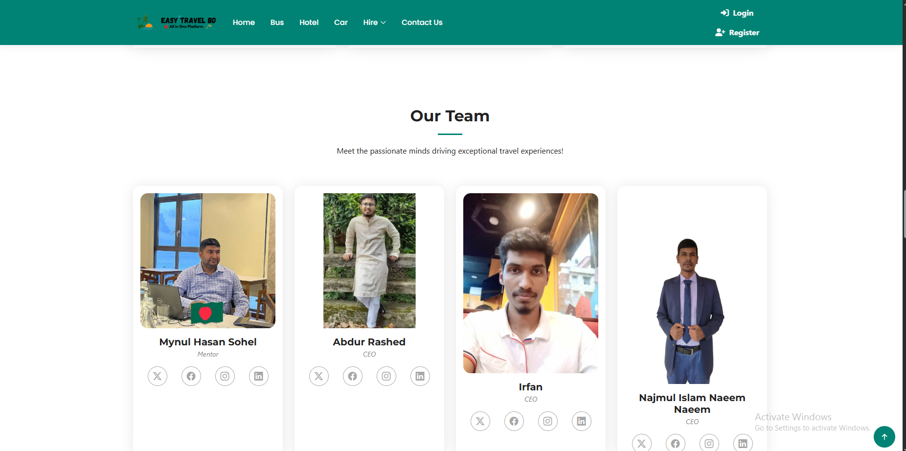
<br>
The homepage provides a user-friendly interface with the following sections:  

- **Navbar**:  A responsive and dynamic navigation bar with buttons. 

- **Hero Section**: A sliding showcase highlighting major services

- **Body**:  
  - Attractive cards showcasing our travel packages.  
  - Details of popular tourist spots in Bangladesh.  

- **Contact Section**: A form to contact using email
- **Footer**:  A neatly organized footer providing quick links and contact details.  
---

### **Hotel Page**  


<br>

<br>
Searchable and result of hotel.Responsive and beautiful ui.

### **Buy Ticket Page**  
A dedicated page for booking bus tickets. Features include:  

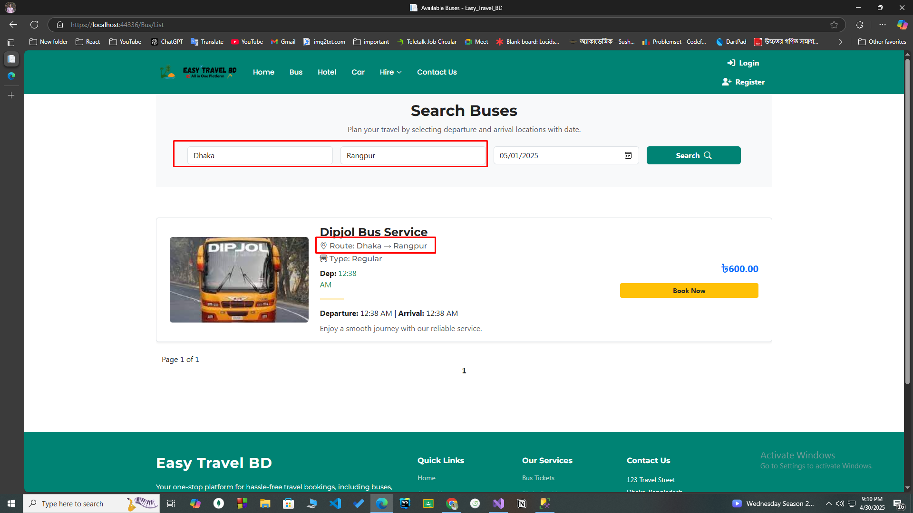
<br>

- **Ticket Search**:  
  - Input fields for **From**, **To**, and **Date**.  
  - A search button to show available buses.  

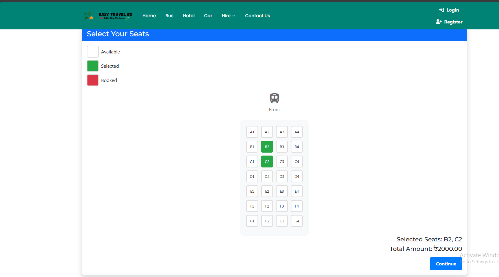
<br>
- **Bus Selection**:  
  - View a list of available buses.  
  - Option to select a seat (if possible).  

- **Payment System** (if applicable).  

- **Ticket Download**:  
  - Generate and download a ticket copy for future reference.  

- **Additional Suggestion**:  
  - Display nearby hotels at the destination area.  

---

### **Tour Guide Page**  
Easily explore and book professional tour guides:
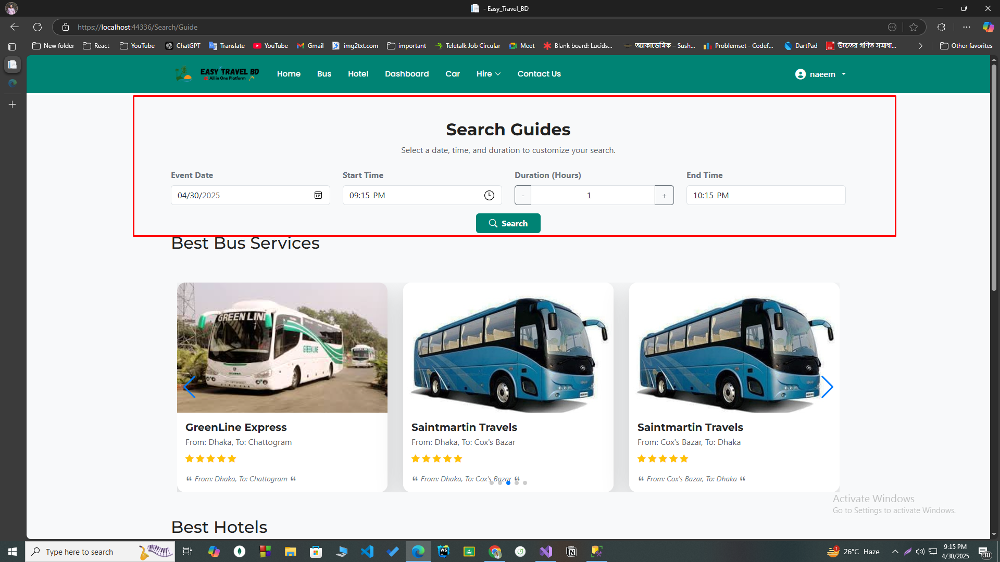
<br>
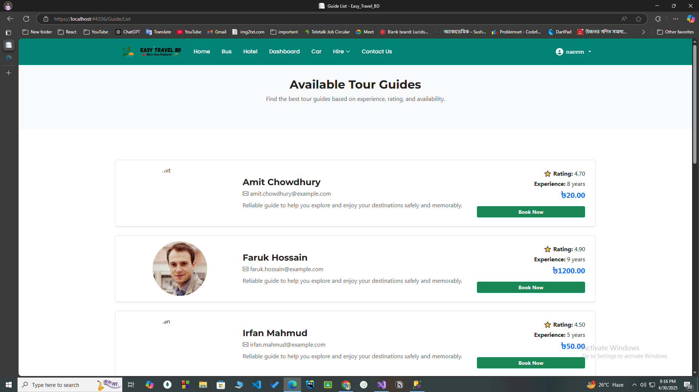
<br>
- Browse a list of available tour guides with ratings and experience.  
- Filter guides based on preferred location, language, and availability.  
- View detailed guide profiles and book directly with customized timing.

---

### **Photographer Page**  
Capture your moments with skilled photographers:

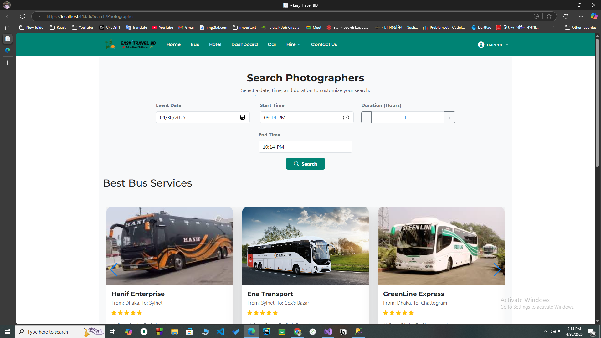
<br>
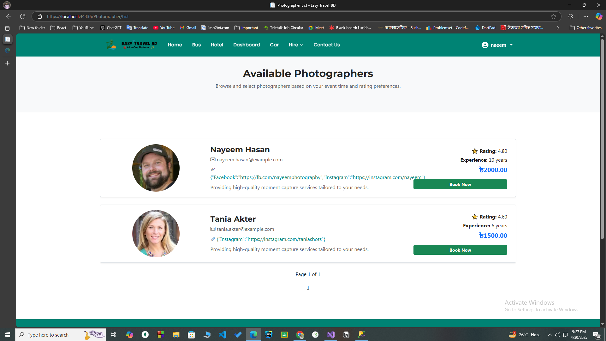
<br>
- Discover photographers by experience, rating, and availability.  
- Access social media links and sample portfolios.  
- Instantly calculate price based on event duration and book with ease.

---
---

### **🔐 Payment Integration with SSLCommerz**  
Ensure secure and seamless transactions for all bookings:
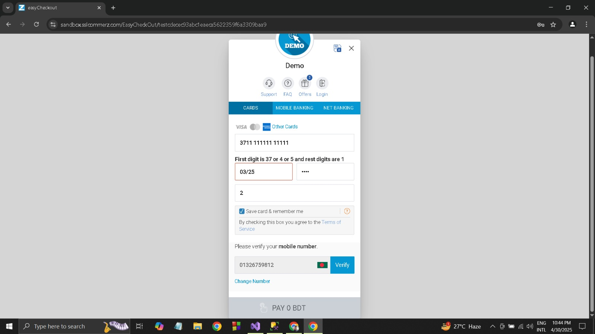
<br>
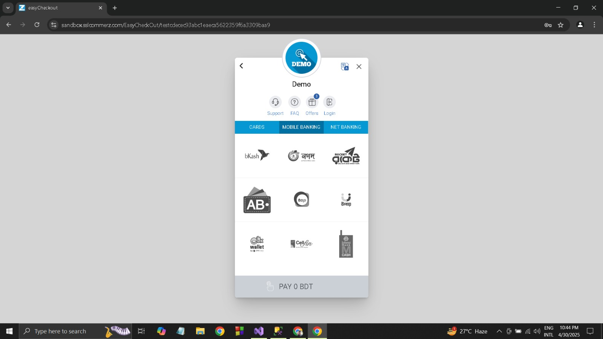
<br>
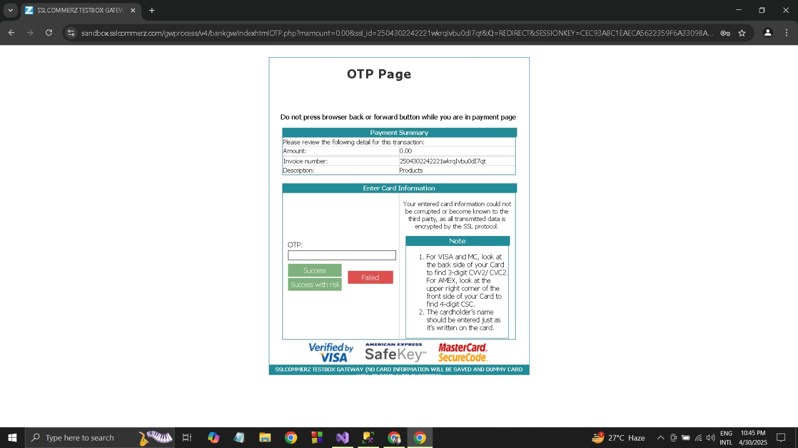
<br>
- Integrated **SSLCommerz** for reliable payment processing.  
- Supports multiple local payment methods (Nagad, Bkash, Visa, Mastercard).  
- Ensures encrypted and safe checkout for users.  
- Payment status and history tracked in user profile.  
- Admin dashboard shows confirmed transactions and payment logs.

---

---
### **Registration and Login Page**  
Secure access and personalized experience for every user:  
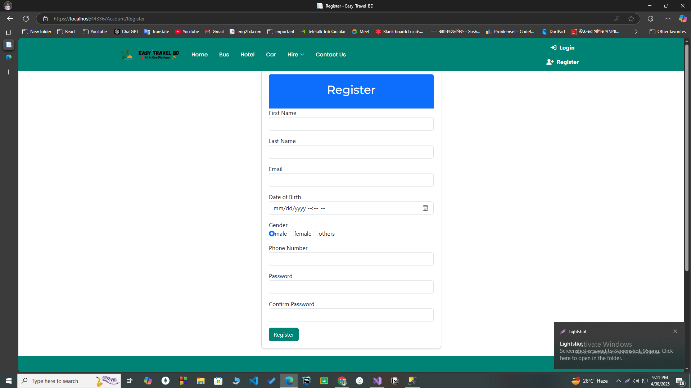
<br>
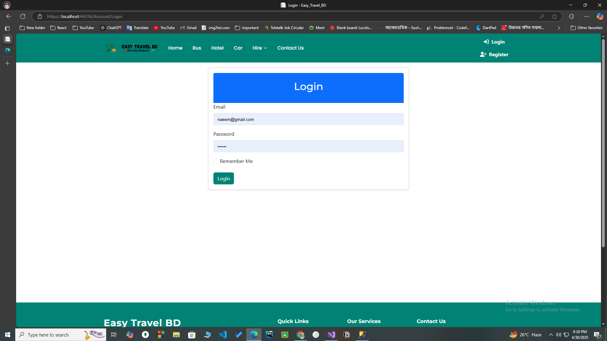
<br>
- User-friendly registration with email and password authentication.  
- Secure login using industry-standard hashing and validation.  
- Role-based redirection for Admin and General Users.  
- Option to reset forgotten password and verify via email.  

---

### **User Profile and History Page**  
Manage your bookings and preferences with a personalized experience:
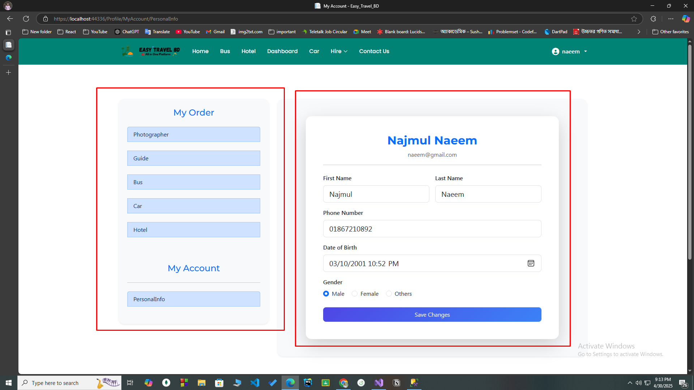
<br>
- Update personal details including contact info and profile picture.  
- View booking history across guides, photographers, hotels, and transports.  
- Track current bookings and cancel or modify as needed.  

---

### **Admin Panel**  
Complete control and monitoring of the platform:
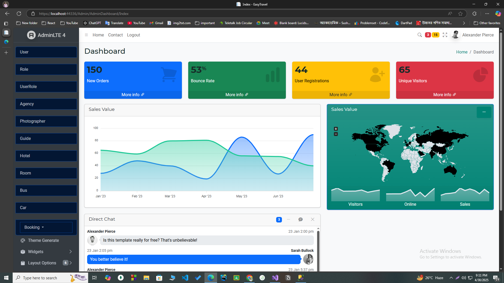
<br>
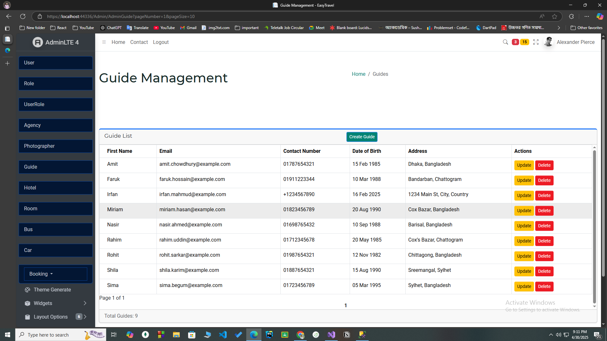
<br>

<br>
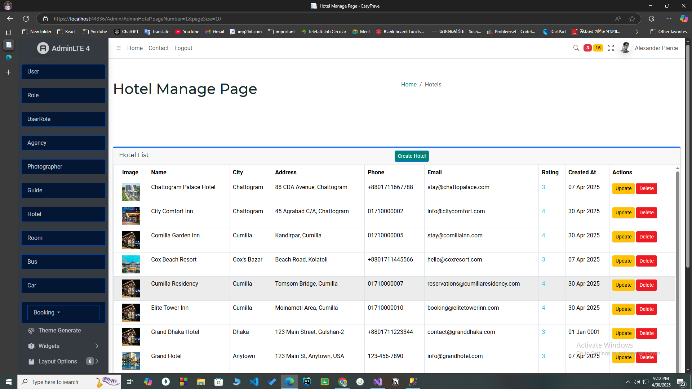
<br>

- Manage users, guides, photographers, agencies, hotels, and transport services.  
- Approve or decline service provider applications.  
- Monitor bookings, reviews, and payments in real time.  
- View detailed analytics and system reports.

---


---

# 🚀 Technologies Used

Our project leverages modern technologies to ensure **performance**, **scalability**, and **security**.  
Below is a detailed overview:

| Technology | Description | Logo |
|:-----------|:------------|:----:|
| **ASP.NET Core 9 (Latest)** | Built with the latest .NET 9 for faster performance, better security, and long-term support. |  |
| **Entity Framework Core** | Used for ORM to interact with Microsoft SQL Server and reduce boilerplate code. |  |
| **Microsoft SQL Server** | Primary database for storing user, booking, and management data securely and efficiently. |  | 
| **SignalR** | Real-time communication for instant booking notifications and live updates. |  |
| **Azure Cloud** | Hosting the application for global scalability, reliability, and integrated DevOps support. |  |
| **SSLCommerz** | Secure, trusted online payments for bus, hotel, and car bookings. |  |
| **DataTables.js** | Rich, dynamic tables with search, filter, pagination, and export features in admin panels. |  |
| **AdminLTE** | Elegant and responsive admin dashboard template for backend management. |  |
| **Serilog** | Structured logging for better monitoring, debugging, and issue tracking. |  |
| **Autofac** | Dependency Injection (DI) management, improving code flexibility and testability. |  |
| **Identity Framework** | Handles user authentication, authorization, and secure password storage. |  |
| **AutoMapper** | Simplifies object-to-object mapping (DTOs ↔ Entities) to keep code clean and organized. |  |
| **NUnit & Moq** | Robust unit testing and mocking dependencies for reliability and stability. |  |
| **Docker** | Containerization to ensure smooth deployment and environment consistency across development, testing, and production. |  |
| **GitHub** | Version control, collaboration, code reviews, CI/CD integration, and issue tracking using GitHub. |  |
| **Bootstrap** | Responsive UI design, pre-built components, and utility classes for faster frontend development. |  |
| **jQuery** | Simplifies DOM manipulation, AJAX calls, and event handling for dynamic user interactions. |  |

---

# 🎯 Why We Chose These Technologies

- **Latest & Reliable**: We chose the latest .NET and Azure stack to ensure maximum security and support.
- **Scalable**: Azure, SQL Server, and SignalR allow handling many users and real-time data efficiently.
- **Maintainable**: AutoMapper, Entity Framework, and Autofac keep the system modular and maintainable.
- **Security**: Identity Framework, SSLCommerz, and structured logging with Serilog ensure secure user and transaction handling.
- **Professional UI/UX**: AdminLTE and DataTables provide a seamless, professional user experience.
- **Testing-First Mindset**: NUnit and Moq ensure high code quality and minimum production bugs.

---
## 🏛️ Architecture & Design Patterns

Our project is structured with a strong focus on scalability, maintainability, and best practices. Below are the key architecture and design patterns we have implemented:

| **Concept/Pattern** | **Description** |
| :-------------------| :---------------|
| **Clean Architecture** | We structured the solution based on Clean Architecture principles to keep business logic independent from frameworks and external technologies. It improves maintainability, testability, and scalability. |
| **Repository Pattern** | Applied to abstract data access logic and provide a flexible architecture that isolates database operations from the business layer. |
| **Unit of Work** | Ensures that multiple repository operations are coordinated and committed together, providing better transaction management and reducing redundant database calls. |
| **SOLID Principles** | The entire project strictly follows SOLID principles (Single Responsibility, Open/Closed, Liskov Substitution, Interface Segregation, Dependency Inversion) to create robust, loosely-coupled, and easily extendable code. |
| **Factory Pattern** | Used for creating instances where object creation is complex or requires control, promoting loose coupling and better management of object lifecycle. |
| **GitFlow** | A Git branching strategy that defines strict roles for branches and organizes releases, hotfixes, and feature development, improving collaboration and deployment processes. |

---

✅ **Result:**  
Using these design patterns ensures that our application is **highly maintainable**, **scalable**, **testable**, and **future-proof** for upcoming features and changes.

---

## 📂 Project Directory Structure

Here’s the directory structure of the **Dynamic-Dev** project:

```
EasyTravel
│
├── EasyTravel.Web/                     # Blazor frontend project
│   ├── wwwroot/                        # Static files (CSS, JS, images, etc.)
│   │   ├── css/
│   │   ├── js/
│   │   ├── images/
│   │   └── assets/
│   ├── Shared/                         # Shared components
│   ├── Areas/                          # Admin and other areas
│   │   ├── Admin/
│   │   │   ├── Controllers/
│   │   │   ├── Views/
│   │   │   └── Mappings/
│   ├── Views/                          # Razor views
│   │   ├── Home/
│   │   └── Shared/
│   ├── Data/                           # Application data
│   ├── EasyTravel.Web.csproj           # Project file
│
├── EasyTravel.Application/             # Application layer
│   ├── Services/                       # Business logic services
│   │   ├── Admin/
│   │   ├── Interfaces/
│   ├── Factories/                      # Factory classes
│   ├── EasyTravel.Application.csproj   # Project file
│
├── EasyTravel.Domain/                  # Domain layer
│   ├── Entities/                       # Domain entities
│   ├── Services/                       # Domain services
│   ├── Repositories/                   # Repository interfaces
│   ├── EasyTravel.Domain.csproj        # Project file
│
├── EasyTravel.Infrastructure/          # Infrastructure layer
│   ├── Repositories/                   # Repository implementations
│   ├── Data/                           # Database-related files
│   │   ├── Migrations/
│   ├── EasyTravel.Infrastructure.csproj # Project file
│
├── EasyTravel.Test/                    # Unit and integration tests
│   ├── ApplicationTests/               # Tests for the application layer
│   │   ├── ServiceTests/
│   ├── DomainTests/                    # Tests for the domain layer
│   ├── InfrastructureTests/            # Tests for the infrastructure layer
│   ├── EasyTravel.Test.csproj          # Project file
│
├── .github/                            # GitHub Actions workflows
│   ├── workflows/
│   │   ├── main_easytravelbd.yml       # CI/CD workflow for deployment
│   │   ├── sonarcloud.yml              # Workflow for SonarCloud analysis
│
├── EasyTravel.sln                      # Solution file

```

## 📈 Future Plans

- 🗺️ **Real-time guide/vehicle tracking** using GPS and Maps API  
  Enable users to track tour guides or hired vehicles in real-time using Google Maps or OpenStreetMap integration.

- 🧾 **Integration with hotel chains for real-time availability**  
  Partner with hotel APIs or chains to fetch live room availability, offers, and pricing for seamless booking experiences.

- 🤖 **AI-based smart suggestions for complete travel packages**  
  Use machine learning to recommend optimized travel plans based on user's interests, search history, location, and budget.

- 📱 **Cross-platform mobile app using .NET MAUI or React Native**  
  Launch fully functional mobile apps supporting both Android and iOS for broader user accessibility and convenience.


### 🔗 Useful Links

| Resource      | Link                                |
|---------------|-------------------------------------|
| 🌐 Live Site  | [Visit Website](https://easytravelbd-enc3h9ehc9hng9da.eastasia-01.azurewebsites.net/) |
| 🐙 GitHub     | [GitHub Repo](https://github.com/Learnathon-By-Geeky-Solutions/dynamic-dev) |
| 🐳 Docker Hub | [Docker Image](https://hub.docker.com/r/csenaeem/easytravelbd) |


## Vision  
Easy Travel BD aims to revolutionize the travel experience in Bangladesh by offering a one-stop platform for all travel needs. Whether you're a solo traveler, a family, or a tour group, our application is designed to make your journey smooth, secure, and memorable.

---
### 🚀 Getting Started  
Follow the steps below to clone, set up, and run the project locally:

#### 1️⃣ Clone the Repository  
```bash
git clone https://github.com/Learnathon-By-Geeky-Solutions/dynamic-dev
cd dynamic-dev/projet/easy-travel-bd

```
Change Connection string
```bash
"ConnectionStrings": {
  "DefaultConnection": "Server=YOUR_SERVER;Database=YOUR_DB Trusted_Connection=True;MultipleActiveResultSets=true"
}
```