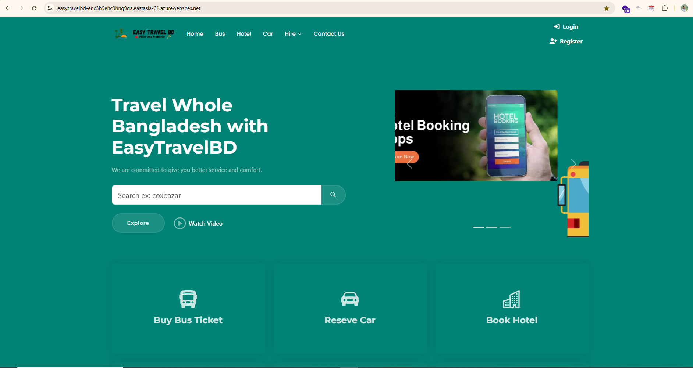
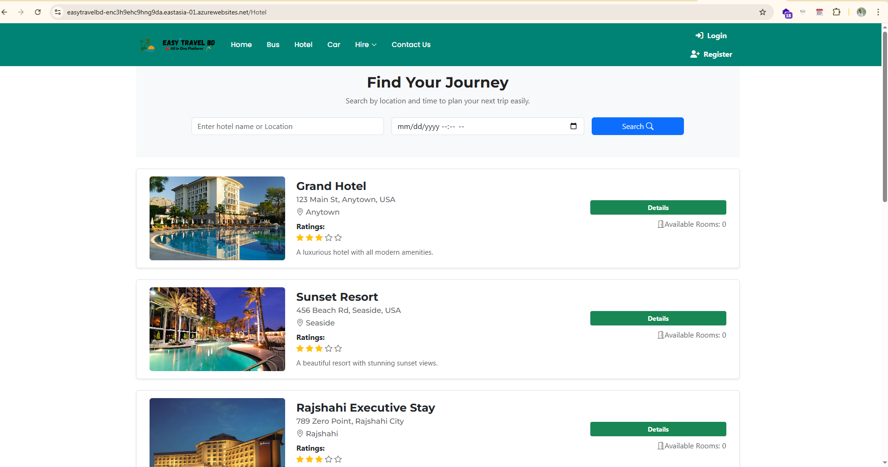

# dynamic-dev

## Team Members
- [naeemcse](https://github.com/naeemcse "Team Leader") (Team Leader)
- [abdurrashed](https://github.com/abdurrashed)
- [IrfanMahmud1](https://github.com/IrfanMahmud1)


**Easy Travel BD** is a comprehensive travel management platform designed to make traveling across Bangladesh convenient and enjoyable. From booking bus tickets to finding the best hotels, tour guides, and travel agencies, our platform provides a seamless experience for travelers. Additionally, Easy Travel BD enables users to explore tourist spots, read blogs, and share their travel experiences.

---


## 🌐 Live Demo

<p align="center">
  <a href="https://easytravelbd-enc3h9ehc9hng9da.eastasia-01.azurewebsites.net/" target="_blank">
    
  </a>
</p>

---
## 👨‍💻 Team

Meet the passionate developers behind **Easy Travel BD**:

| Role      | Name & GitHub Profile                               |
| --------- | --------------------------------------------------- |
| Team Lead | [Najmul Islam Naeem](https://github.com/ImamIfti056) |
| Developer | [Irfan Mahmud](https://github.com/IrfanMahmud1)             |
| Developer | [Abdur Rashed](https://github.com/abdurrashed)      |

---

### 🧠 Our Guide & Mentor

A heartfelt appreciation to **[Maynul Islam Sohel](https://github.com/sohelatbs23)**

---


## Features  

# 👥 Roles and Their Activities

| **Role**                  | **Permissions / Activities**                                                                 |
|----------------------------|----------------------------------------------------------------------------------------------|
| **Public (Anyone)**        | - Search and explore buses<br>- Explore hotels, private cars, photographers, guides, agencies <br> - Create account |
| **Registered User**        | - Book buses<br>- Book hotels<br>- Book private cars<br>- Hire photographers<br>- Hire tour guides <br> - Update their profile <br> - Show their previous history |
| **Bus Manager**            | - Add and manage buses<br>- Update bus information<br>- View bus booking history             |
| **Private Car Manager**    | - Add and manage private cars<br>- Update car information<br>- View private car bookings      |
| **Hotel Manager**          | - Add and manage hotels<br>- Update room availability<br>- View hotel booking history         |
| **Photographer**           | - Create and manage profile<br>- Manage photography bookings and schedule                     |
| **Tour Guide**             | - Create and manage profile<br>- Manage tour guide bookings and availability                  |
| **Agency Manager**         | - Add and manage travel agencies<br>- Manage agency tours and related services                |
| **Super Admin**         | -  Distribute money to service provider <br> - Create,Update,Delete Service provider and User and all other permited task|

*Strictly we handed the authorization for security*


### **Home Page**  


<br>
The homepage provides a user-friendly interface with the following sections:  


- **Body**:  
  - Attractive cards showcasing our travel packages.  
  - Details of popular tourist spots in Bangladesh.  

---

### **Hotel Page**  


<br>
Searchable and result of hotel.Responsive and beautiful ui.

### **Buy Ticket Page**  
A dedicated page for booking bus tickets. Features include:  

- **Ticket Search**:  
  - Input fields for **From**, **To**, and **Date**.  
  - A search button to show available buses.  

- **Bus Selection**:  
  - View a list of available buses.  
  - Option to select a seat (if possible).  

- **Payment System** (if applicable).  

- **Ticket Download**:  
  - Generate and download a ticket copy for future reference.  

- **Additional Suggestion**:  
  - Display nearby hotels at the destination area.  

---

### **Tour Booking Page**  
A page to book hotels and plan tours. Features include:  

- Display a list of hotels with photos, descriptions, and prices.  
- Click on a hotel for detailed information, additional photos, and booking options.  
- Receive booking documents as a printable copy.  
- **Location Selector**: Easily filter hotels by location.  

---

### **Travel Agency Page**  
Find and hire travel agencies with ease:  

- View a list of trusted travel agencies.  
- Click on an agency for detailed information and hiring options.  

---

### **Blog Page**  
A space to share and explore travel stories and tips:  

- **Admin** (and optionally users) can post blogs about:  
  - Tourist spots in Bangladesh.  
  - Travel tips and experiences.  
  - Recommendations for tour guides and agencies.  

---

### **Admin Page**  
A robust backend for managing platform data:  

- Add or remove:  
  - Buses  
  - Hotels  
  - Travel Agencies  
- Post about tourist spots. 
- Manage user accounts.
- View and respond to user feedback.
- Monitor platform analytics.
- assign roles to users.

---


---


---
## 🏛️ Architecture & Design Patterns

Our project is structured with a strong focus on scalability, maintainability, and best practices. Below are the key architecture and design patterns we have implemented:


---

✅ **Result:**  
Using these design patterns ensures that our application is **highly maintainable**, **scalable**, **testable**, and **future-proof** for upcoming features and changes.

---

## 📂 Project Directory Structure

Here’s the directory structure of the **Dynamic-Dev** project:

```
EasyTravel
│
├── EasyTravel.Web/                     # Blazor frontend project
│   ├── wwwroot/                        # Static files (CSS, JS, images, etc.)
│   │   ├── css/
│   │   ├── js/
│   │   ├── images/
│   │   └── assets/
│   ├── Shared/                         # Shared components
│   ├── Areas/                          # Admin and other areas
│   │   ├── Admin/
│   │   │   ├── Controllers/
│   │   │   ├── Views/
│   │   │   └── Mappings/
│   ├── Views/                          # Razor views
│   │   ├── Home/
│   │   └── Shared/
│   ├── Data/                           # Application data
│   ├── EasyTravel.Web.csproj           # Project file
│
├── EasyTravel.Application/             # Application layer
│   ├── Services/                       # Business logic services
│   │   ├── Admin/
│   │   ├── Interfaces/
│   ├── Factories/                      # Factory classes
│   ├── EasyTravel.Application.csproj   # Project file
│
├── EasyTravel.Domain/                  # Domain layer
│   ├── Entities/                       # Domain entities
│   ├── Services/                       # Domain services
│   ├── Repositories/                   # Repository interfaces
│   ├── EasyTravel.Domain.csproj        # Project file
│
├── EasyTravel.Infrastructure/          # Infrastructure layer
│   ├── Repositories/                   # Repository implementations
│   ├── Data/                           # Database-related files
│   │   ├── Migrations/
│   ├── EasyTravel.Infrastructure.csproj # Project file
│
├── EasyTravel.Test/                    # Unit and integration tests
│   ├── ApplicationTests/               # Tests for the application layer
│   │   ├── ServiceTests/
│   ├── DomainTests/                    # Tests for the domain layer
│   ├── InfrastructureTests/            # Tests for the infrastructure layer
│   ├── EasyTravel.Test.csproj          # Project file
│
├── .github/                            # GitHub Actions workflows
│   ├── workflows/
│   │   ├── main_easytravelbd.yml       # CI/CD workflow for deployment
│   │   ├── sonarcloud.yml              # Workflow for SonarCloud analysis
│
├── EasyTravel.sln                      # Solution file

```


## Vision  
Easy Travel BD aims to revolutionize the travel experience in Bangladesh by offering a one-stop platform for all travel needs. Whether you're a solo traveler, a family, or a tour group, our application is designed to make your journey smooth, secure, and memorable.

---

## Getting Started
1. Clone the repository
2. Install dependencies
3. Start development

## Development Guidelines
1. Create feature branches
2. Make small, focused commits
3. Write descriptive commit messages
4. Create pull requests for review

## Resources
- [Project Documentation](docs/Features)
- [Development Setup](docs/setup.md)
- [Contributing Guidelines](CONTRIBUTING.md)
